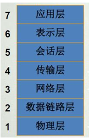
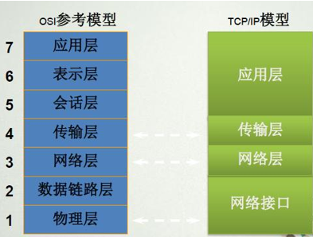

# 计算机网络体系结构

- 协议及其体系结构概念
- 具有五层协议的体系结构
- OSI/RM    TCP/IP 

### 1. 协议及其体系结构
**体系结构**
>计算机网络的体系结构(architecture)是计算机网络的各层及其协议的集合。 
>体系结构就是这个计算机网络及其部件所应完成的功能的精确定义。
>体系结构是抽象的，而实体则是具体的，是真正运行计算机硬件和软件

>**各层所需要完成的功能有：**
> > - 差错控制
> > - 流量控制
> > - 分段和重装
> > - 复用和分用
> > - 连接的建立和释放

**协议**
>为进行网络中的数据交换而建立的规则、标准或约定成为网络协议，也简称协议
> *网络协议主要由以下元素组成*
> >- 语法  数据与控制信息的结构或格式 。 
> > - 语义  需要发出何种控制信息，完成何种动作以及做出何种响应。 
> > - 同步  事件实现顺序的详细说明。 
### 2. 开放系统互连参考模型(OSI/RM)
它从低到高分别是：物理层、数据链路层、网络层、传输层、会话层、表示层和应用层。

#### 物理层
物理层提供用于建立、保持和断开物理连接的机械的、电气的、功能的和过程的条件。其典型的协议有RS 232C、RS 449/422/423、V.24和X.21、X.21bis等。

物理层的主要功能是：
1. 为数据端设备提供传送数据的通路
2. 传输数据。物理层要形成适合数据传输需要的实体，为数据传送服务。
3. 完成物理层的一些管理工作。
#### 数据链路层
   每次通信都要经过建立通信联络和拆除通信联络两个过程。这种建立起来的数据收发关系就叫做数据链路。
   链路层是为网络层提供数据传送服务的，这种服务要依靠本层具备的功能来实现。链路层应具备如下功能：
1. 链路连接的建立、拆除和分离；
2. 帧定界和帧同步。链路层的数据传输单元是帧
3. 顺序控制，指对帧的收发顺序的控制；
4. 差错检测和恢复。还有链路标识，流量控制等等。
5. 数据链路层分成了两个子层，一个是逻辑链路控制，另一个是媒体访问控制.

#### 网络层
网络层（network layer）的主要功能是完成网络中主机间的报文传输

网络层为建立网络连接和为上层提供服务，应具备以下主要功能：
1. 路由选择和中继；
2. 激活，终止网络连接；
3. 在一条数据链路上复用多条网络连接，多采取分时复用技术；
4. 检测与恢复；
5. 排序，流量控制；
6. 服务选择；
7. 网络管理。
数据的传送单位是分组或包
#### 传输层
端到端开放系统之间的数据传送控制层。主要功能是端开放系统之间数据的收妥确认。另外，还通过复用、分段和组合、连接和分离、分流和合流等技术措施，提高吞吐量和服务质量。传输层还要具备差错恢复，流量控制等功能。
面向连接的TCP
面向无连接的UDP
#### 会话层

#### 表示层

#### 应用层
应用层确定**进程**之间通信的性质以满足用户的需要(这反映在用户所产生的服务请求)

### TCP/IP

