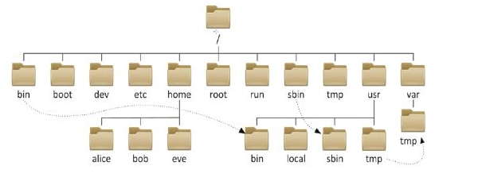

> 摘要：

# Linux文件系统的类型以及特点
在Linux上没有盘符的概念，也就是说Linux不存在C盘、D盘等。
已建立的系统的硬盘分区都被挂载到某一个目录下，用户通过操作目录来实现硬盘的读写。
# Linux文件系统与Windows的区别
1. Linux是一个树形目录结构，而Windows是多个树。
2. Linux使用 **/** 来作为目录分隔符，而Windows使用 **\\** 来作为分隔符。

# Linux文件系统

## 目录结构
在linux中目录结构是一个树形结构：

|   目录  |  内容   |
| --- | --- |
|   /bin  |  构建最小系统所需要的命令（最常用的命令）   |
|  /boot   |  内核与启动文件   |
|  /dev   |  各种设备文件   |
|   /etc  |   系统软件的启动和配置文件  |
|   /home  |  用户的主目录   |
|   /lib  |   存放系统程序运行所需的库文件  |
|   /media  |   可移动介质的安装点  |
|   /opt  |   可选的应用包（一般存放用户自己安装的软件）  |
|   /proc  |   进程映像名  |
|   /root  |  root用户的主目录   |
|  /sbin  |  和操作系统有关的命令  |
| /tmp   |  临时文件目录   |
|  /usr| 非系统程序和命令  |
|/var|  系统专用的数据和配置文件  |

## 访问权限

## 管理文件系统的常用命令